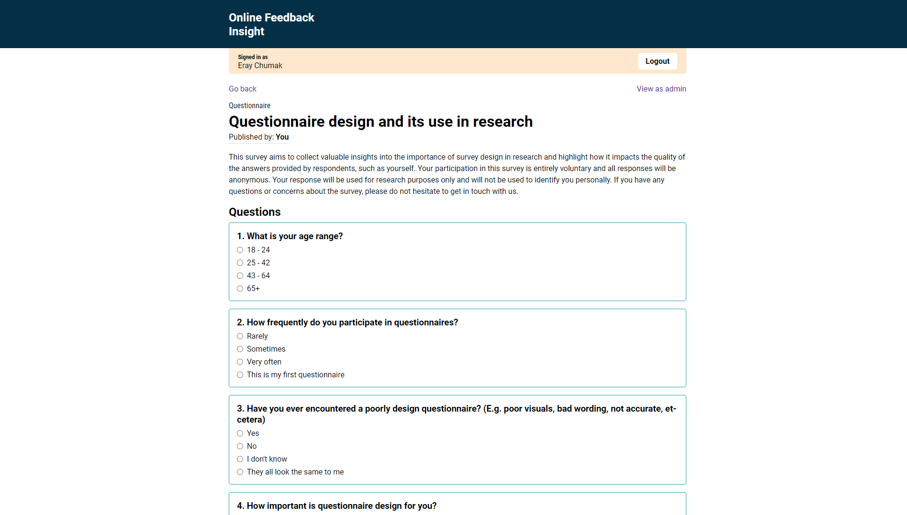
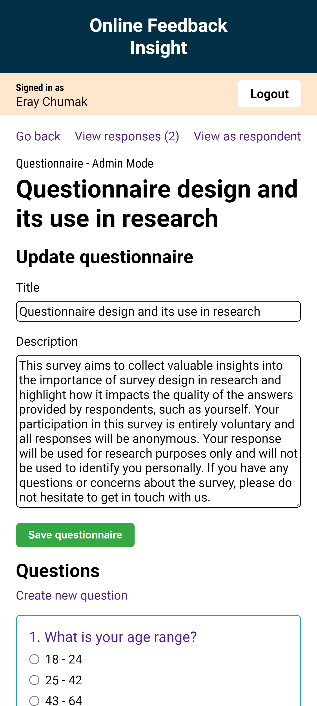
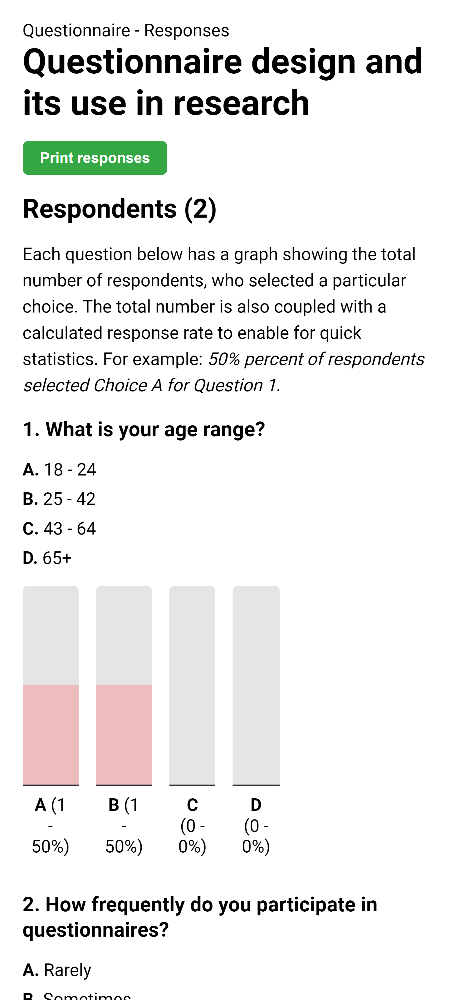

# Online Feedback Insight (OFI)

This system is built with the Laravel 6 PHP framework. It relies on using the [Laravel 6 - Development Container](https://github.com/Edge-Hill-Univeristy-Web/CIS2167-Laravel-6) repository created by Edge Hill University to develop and run. Additionally, the project relies on the [MariaDB Docker Image](https://hub.docker.com/_/mariadb) container for the database.

This repository is the implementation part of coursework two for the CIS2167 - Server & Client Side Scripting module at Edge Hill University.

## Screenshot previews


<details>
<summary>Mobile previews</summary>

<details>
<summary>Questionnaire admin mode preview</summary>


</details>

<details>
<summary>Questionnaire responses preview</summary>


</details>
</details>

## Running the system (setup)

### Prerequisites
You will need the following before starting:
- `Visual Studio Code` (VSC)
- VSC `Dev Containers` extension
- `Git`
- `Docker`

### Detailed steps
The following steps assume no prior setup, you may skip to step 5 if a MariaDB container already exists and is connected to the `devnet` virtual network.

#### MariaDB
1. Run `docker pull mariadb` to pull the image.
2. Run `docker run -p 3306:3306 --detach --name MariaDB --env MARIADB_USER=<YOUR-NAME> --env MARIADB_PASSWORD=webdev --env MARIADB_ROOT_PASSWORD=password  mariadb:latest` to create a container using the image.
3. Run `docker exec -it MariaDB bash` to access the shell within the database container.
4. Run `mysql -u root -p` and enter `password` as the password.
5. Run `CREATE DATABASE ofi;` to create the `ofi` database for the application to use.

#### Docker Virtual Network
6. Run `docker network create devnet` to create the virtual network for the dev and database containers to communicate between each other.
7. Run `docker network connect devnet MariaDB` to connect the database container to the virtual network.

#### Cloning the project
8. Create an empty project folder called `OFI` for where the dev container will be put into.
9. Download the [Laravel 6 - Development Container](https://github.com/Edge-Hill-Univeristy-Web/CIS2167-Laravel-6) as a zip folder.
10. Extract the folder contents into the empty `OFI` project folder.
11. Open the `OFI` project folder in VSC.
12. Go to View > Command Palette... and type in Open Folder in Container....
13. Git clone the `OFI` repository inside the root of the dev container.

#### Installing dependancies
14. Run `composer install` inside the cloned repository _(it will also be called OFI)_.
15. Run `cp .env.example .env` to create a `.env` file.
16. Run `php artisan key:generate`.

#### Connecting project to devnet
17. Run `docker network rename <current_project_container_name> OFI` to rename the docker container for the project.
18. Run `docker network connect devnet OFI` to connect the project docker container to the virtual network.
19. Fill in the `.env` file to connect the database to the project, use `docker network inspect devnet` to find the IPs:

```
DB_CONNECTION=mysql
DB_HOST=<DEVNET_MARIADB_IP>
DB_PORT=3306
DB_DATABASE=ofi
DB_USERNAME=root
DB_PASSWORD=password
```
#### Database migrations and seeding
21. Run `php artisan migrate:fresh --seed` to create the necessary tables and seed them with data.

#### Running application
22. Run `php artisan serve` to run the application.
